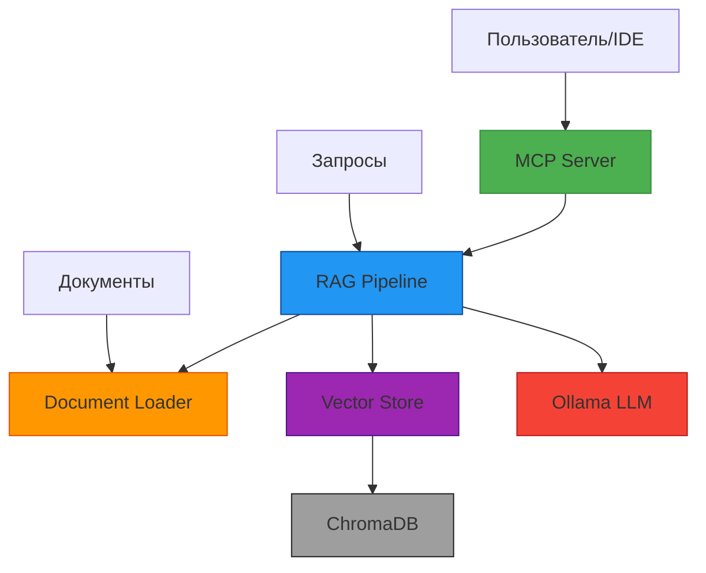
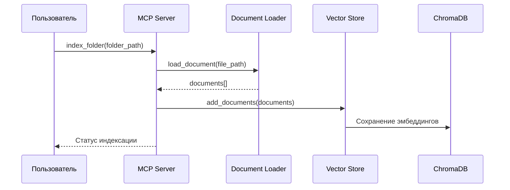
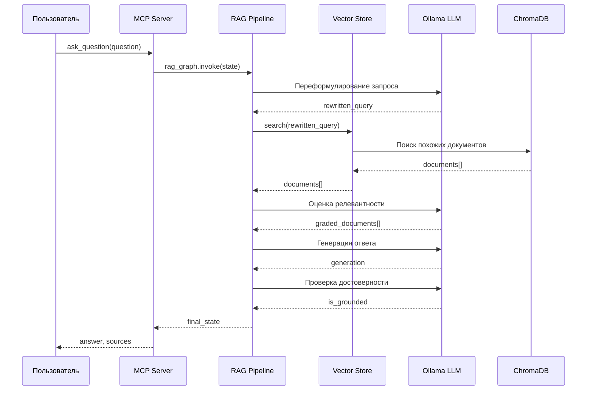

# Архитектура проекта

## Обзор

RAG Knowledge Base — это MCP-сервер, который превращает локальную папку с документами в поисковую базу знаний. Сервер позволяет индексировать документы различных форматов и задавать вопросы к ним с помощью локальной LLM через Ollama.

## Архитектура системы



## Основные компоненты

### 1. MCP Server (main.py)
- **Назначение**: Точка входа в приложение, предоставляет API для взаимодействия с внешними системами
- **Функции**:
  - Экспонирование инструментов для индексации документов и ответов на вопросы
  - Обработка запросов от IDE или других клиентов
  - Управление жизненным циклом приложения

### 2. RAG Pipeline (rag_pipeline.py)
- **Назначение**: Реализация пайплайна Retrieval-Augmented Generation с коррекцией
- **Компоненты**:
  - **Rewrite Query**: Переформулирование запроса для улучшения поиска
  - **Retrieve**: Поиск релевантных документов в векторной базе
  - **Grade Documents**: Оценка релевантности найденных документов
  - **Generate Answer**: Генерация ответа на основе релевантных документов
  - **Hallucination Check**: Проверка достоверности сгенерированного ответа
  - **Broaden Query**: Расширение запроса при недостатке релевантных документов

### 3. Document Loader (document_loader.py)
- **Назначение**: Загрузка и предварительная обработка документов различных форматов
- **Поддерживаемые форматы**:
  - Текстовые файлы (.txt, .md, .rst)
  - Файлы кода (.py, .js, .ts) с разбивкой по функциям/классам
  - Структурированные данные (.json, .jsonl, .yaml)

### 4. Vector Store (vector_store.py)
- **Назначение**: Хранение и поиск векторных представлений документов
- **Реализация**: ChromaDB с персистентным хранением
- **Функции**:
  - Добавление документов с созданием эмбеддингов
  - Поиск похожих документов по векторному представлению
  - Получение статистики по индексированным документам

### 5. Ollama LLM
- **Назначение**: Локальная генерация текста для переформулирования запросов, оценки релевантности и генерации ответов
- **Модель**: По умолчанию используется qwen2.5:3b

## Поток данных

### Индексация документов


### Обработка вопросов


## Docker конфигурация

### Сервисы
1. **ollama**: Контейнер с Ollama для запуска локальной LLM
2. **server**: Контейнер с MCP-сервером

### Порты
- 11434: Порт Ollama
- 8001: Порт MCP-сервера

## Инструменты MCP

| Инструмент | Назначение | Требуется LLM |
|------------|------------|---------------|
| `index_folder` | Индексация документов в папке | Только эмбеддинги |
| `ask_question` | Ответ на вопрос по индексированным документам | Да |
| `find_relevant_docs` | Поиск релевантных документов | Только эмбеддинги |
| `summarize_document` | Создание краткого содержания документа | Да |
| `index_status` | Получение статистики индекса | Нет |

## Технологический стек

- **Язык программирования**: Python 3.12
- **Фреймворки**: FastMCP, LangGraph, LangChain
- **Векторная база данных**: ChromaDB
- **LLM**: Ollama (qwen2.5:3b)
- **Контейнеризация**: Docker, Docker Compose
- **Тестирование**: Pytest

## Детализированная архитектура системы

```mermaid
graph LR
    A[Клиенты] --> B[MCP Server]
    B --> C[RAG Pipeline]

    subgraph "RAG Pipeline"
        C --> D[Query Rewriter]
        D --> E[Document Retriever]
        E --> F[Document Grader]
        F --> G[Answer Generator]
        G --> H[Hallucination Checker]
        F --> I[Broaden Query]
        I --> E
        H --> J[Retry Logic]
        J --> G
    end

    subgraph "Data Sources"
        K[Document Files] --> L[Document Loader]
        L --> M[Vector Store]
        N[Ollama LLM] --> O[LLM Interface]
    end

    subgraph "Storage"
        M --> P[ChromaDB]
    end

    C --> O
    E --> M
    F --> O
    G --> O
    H --> O
    I --> O
    D --> O

    style A fill:#4CAF50,stroke:#388E3C
    style B fill:#2196F3,stroke:#0D47A1
    style C fill:#FF9800,stroke:#E65100
    style M fill:#9C27B0,stroke:#4A148C
    style N fill:#F44336,stroke:#B71C1C
    style P fill:#9E9E9E,stroke:#212121
